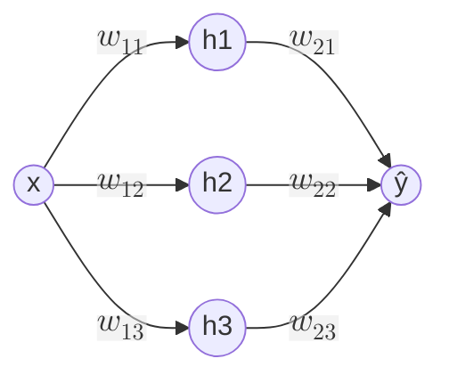
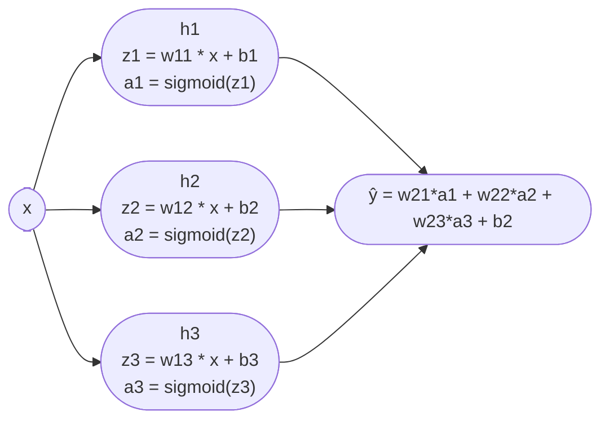
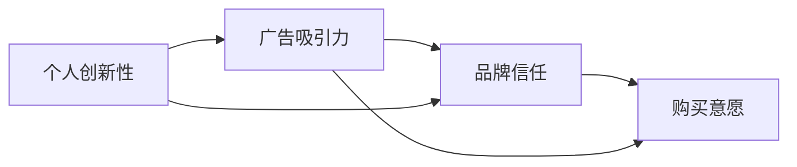

The structure of the simple neural network is as following:

```mermaid
%% LR 表示箭头从左到右
%% mermaid 对 latex 支持的目前并不是太好
graph LR
%% 输入层
    X(("x"))
%% 隐藏层 3 个神经元
    H1((h1))
    H2((h2))
    H3((h3))
%% 输出层
    Y((ŷ))
%% 输入到隐藏层连接
    X -->|" $$w_{11}$$ "| H1
    X -->|" $$w_{12}$$ "| H2
    X -->|" $$w_{13}$$ "| H3
%% 隐藏层到输出层连接
    H1 -->|" $$w_{21}$$ "| Y
    H2 -->|" $$w_{22}$$ "| Y
    H3 -->|" $$w_{23}$$ "| Y
%% 输出层标注
%% ŷ = Σ(w2j * aj) + b2
```

最终的输出层是否需要激活函数取决于问题，

- 预测连续数值时不需要激活函数
- 二分类时需要 sigmoid 激活函数
- 多分类时需要 softmax 激活函数

```mermaid
graph LR
    X(["x"])
    H1(["h1<br>z1 = w11 * x + b1<br>a1 = sigmoid(z1)"])
    H2(["h2<br>z2 = w12 * x + b2<br>a2 = sigmoid(z2)"])
    H3(["h3<br>z3 = w13 * x + b3<br>a3 = sigmoid(z3)"])
    Y(["ŷ = w21*a1 + w22*a2 + w23*a3 + b2"])
    X --> H1
    X --> H2
    X --> H3
    H1 --> Y
    H2 --> Y
    H3 --> Y
```

```mermaid
graph LR
    X[广告吸引力] --> M[品牌信任]
    M --> Y[购买意愿]
    X --> Y
    Z[个人创新性] --> X
    Z --> M
```